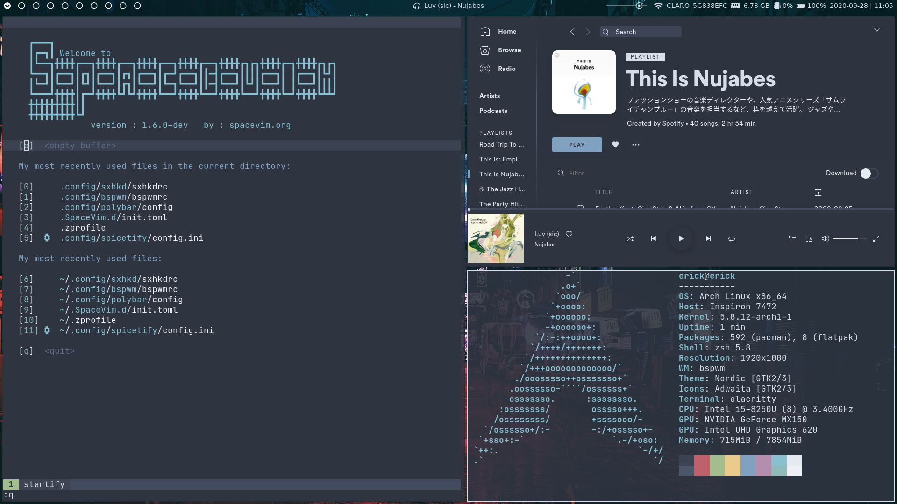

# dotfiles

Arch linux rice with bspwm and polybar




### Applications

- WM - [bspwm](https://github.com/baskerville/bspwm)
- Key binder - [sxhkd](https://github.com/baskerville/sxhkd)
- Status bar - [polybar](https://github.com/polybar/polybar)
- Terminal - [alacritty](https://github.com/alacritty/alacritty)
- GTK Theme - [nordic](https://github.com/EliverLara/Nordic)
- Shell - [zsh](https://github.com/ohmyzsh/ohmyzsh)
- Compositor - [picom](https://github.com/yshui/picom)
- Application launcher - [rofi](https://github.com/davatorium/rofi)
- Lockscreen - [betterlockscreen](https://github.com/pavanjadhaw/betterlockscreen)
- Notifications - [dunst](https://github.com/dunst-project/dunst)
- Editor [spacevim](https://github.com/SpaceVim/SpaceVim)

### Dependencies

- [network-manager](https://gitlab.freedesktop.org/NetworkManager/NetworkManager)
- [playerctl](https://github.com/altdesktop/playerctl)
- [bluetoothctl](https://www.archlinux.org/packages/extra/x86_64/bluez-utils/)
- [pulseaudio](https://wiki.archlinux.org/index.php/PulseAudio)
- [light](https://github.com/haikarainen/light)
- [feh](https://wiki.archlinux.org/index.php/feh)
- [scrot](https://github.com/resurrecting-open-source-projects/scrot)


### [Optional] Applications

- Spotify with [spicify-cli](https://github.com/khanhas/spicetify-cli) [nord](https://github.com/morpheusthewhite/spicetify-themes/tree/master/Nord) theme

### YADM 

This repository is managed by [yadm](https://github.com/TheLocehiliosan/yadm). To get an exact copy you just need to install all the applications and dependencies and then run ```yadm clone https://github.com/erickopelt/dotfiles```

### Wallpaper

To change the wallpaper just copy the file to ~/.wall and update the lockscreen.

``` bash
cp wallpaper.jpg ~/.wall 
betterlockscreen -u ~/.wall
```

